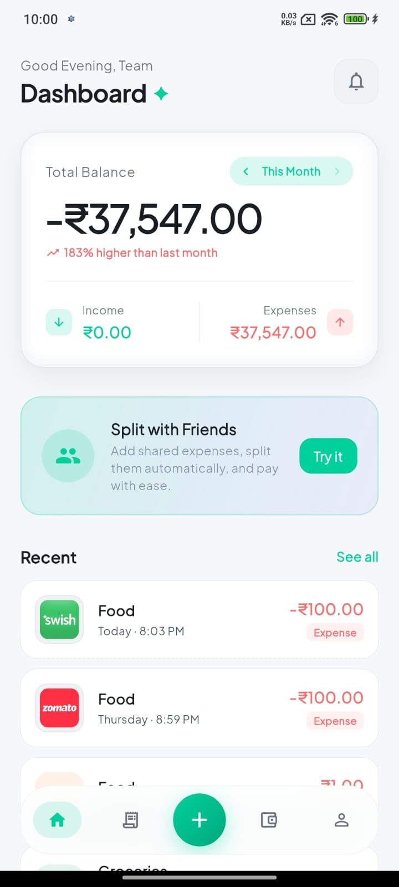
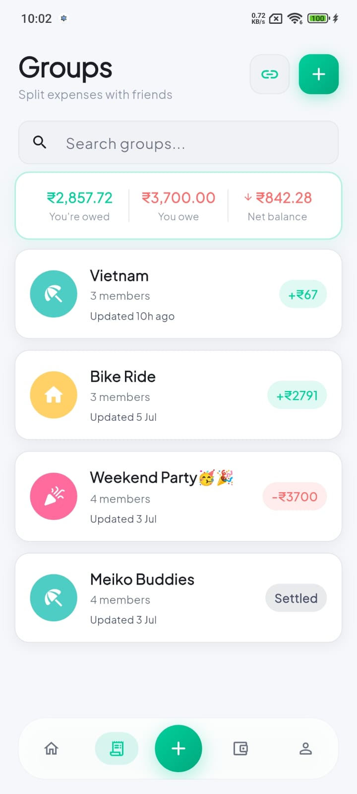
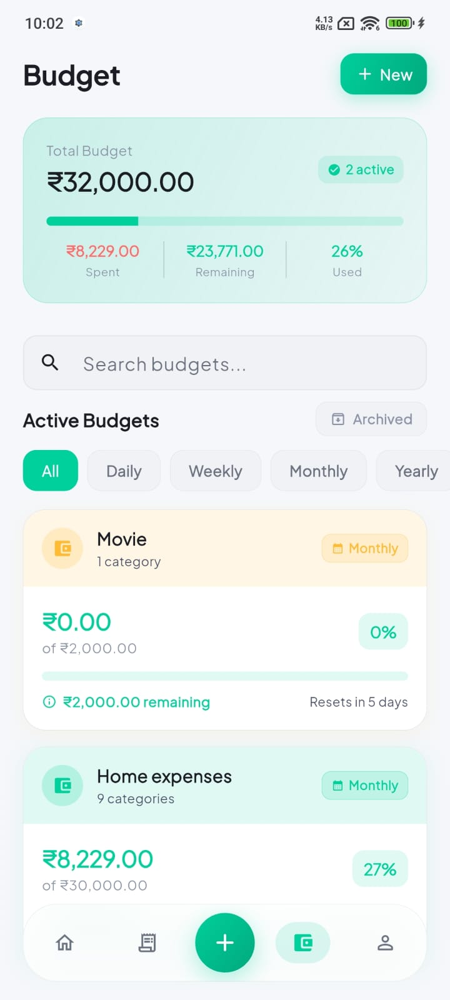
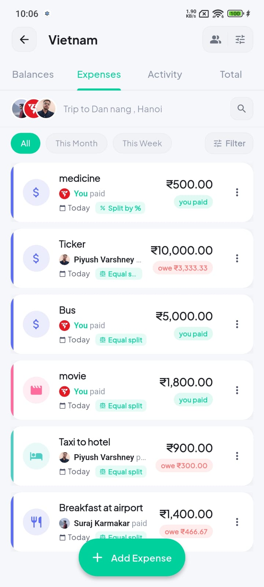
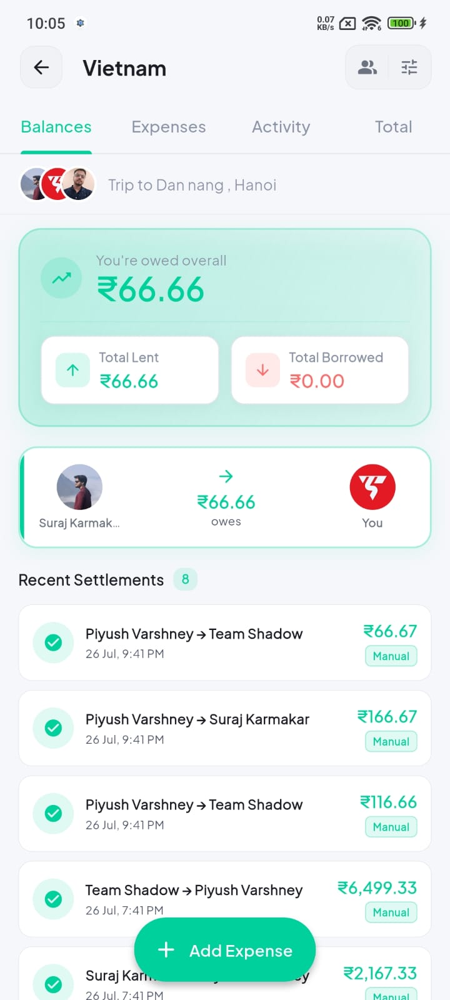
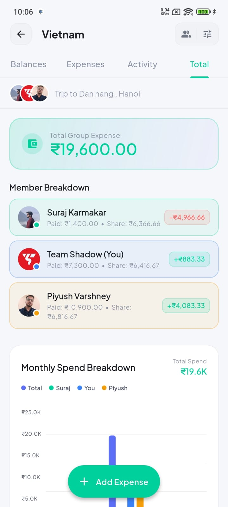
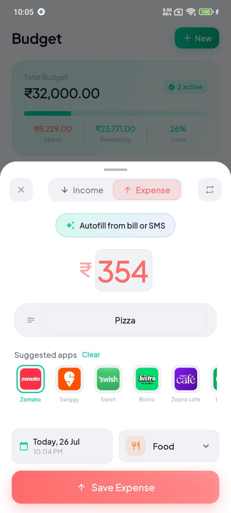
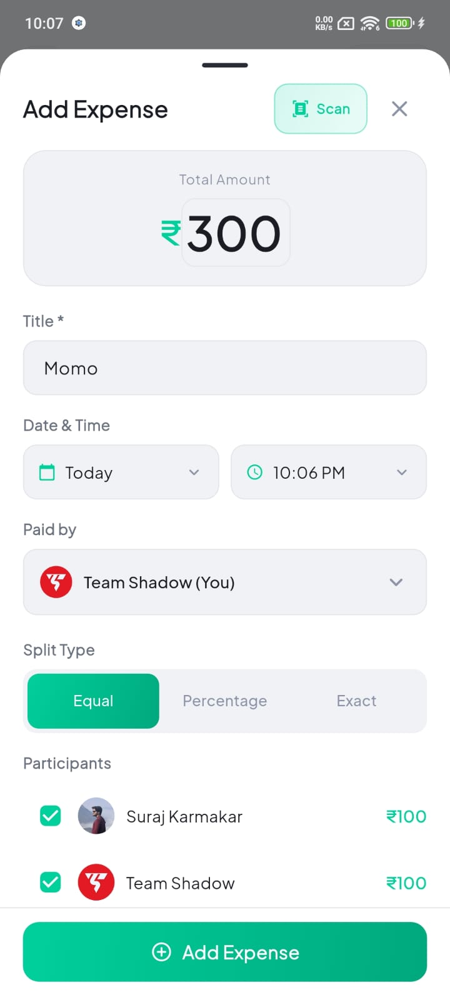
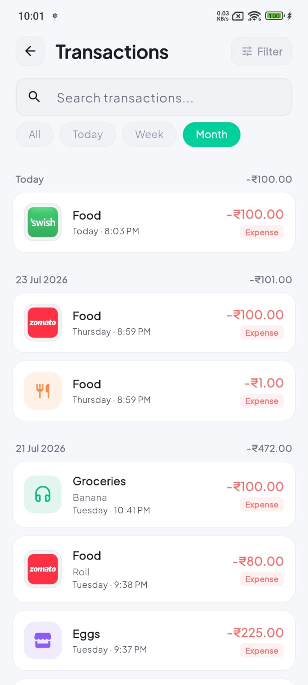

# SplitPay — Premium Expense Tracker & Group Bill Splitting

[](https://flutter.dev)
[](https://riverpod.dev)
[](https://nodejs.org)
[](https://prisma.io)
[](https://firebase.google.com)
[](#)

**SplitPay** (formerly *DimeFlow*) is a state-of-the-art, feature-rich personal finance tracker and group bill-splitting application built with **Flutter** for cross-platform mobile (iOS & Android) and backed by a robust **Node.js / Express / Prisma / PostgreSQL** REST backend. 

Designed with modern glassmorphism aesthetics, fluid micro-animations, and AI-assisted data entry (on-device ML Kit OCR & SMS parsing), SplitPay makes tracking personal spending and settling shared group expenses effortless.

---

## 📸 App Screenshots

| Dashboard | Group Splitting | Active Budgets |
| :---: | :---: | :---: |
|  |  |  |

| Group Expenses | Debt Balances & Settlements | Group Analytics |
| :---: | :---: | :---: |
|  |  |  |

| Smart Add Expense (OCR / SMS) | Add Group Expense | Transaction History & Filters |
| :---: | :---: | :---: |
|  |  |  |

---

## ✨ Key Features

### 👤 Personal Finance Management
- **Instant Expense & Income Logging:** Categorize spending with 15+ custom categories, merchant icons, and note support.
- **Smart Bill Scanner (OCR):** Powered by Google ML Kit Text Recognition to extract total amounts and titles from physical receipts in real-time.
- **SMS Transaction Parser:** Automatically parses financial SMS alerts (bank debits, UPI transfers) to draft transactions with a single tap.
- **Multi-Criteria Search & Filter:** Filter by type, date range, amount range, and categories with live search.

### 👥 Group Bill Splitting & Settlements
- **Group Management:** Create groups for trips, roommates, or events with invite codes and QR code sharing.
- **Flexible Expense Splitting:** Supports **Equal**, **Percentage**, and **Exact Amount** split modes among group participants.
- **Automated Debt Simplification:** Built-in algorithm calculates minimal net settlement transactions (e.g. *“Suraj owes Piyush ₹66.67”*).
- **Direct UPI Settlement:** Integrated UPI intent launching (GPay, PhonePe, Paytm, BHIM) for instant 1-tap debt repayment.
- **Real-Time Group Activity Feed:** Complete audit trail tracking added, edited, deleted expenses, and completed settlements.

### 🎯 Multi-Period Budgeting & Threshold Alerts
- **Custom Budget Limits:** Set daily, weekly, monthly, or yearly spending budgets mapped to specific categories.
- **Visual Progress Tracker:** Real-time spent vs. remaining balance with alert thresholds (e.g. warning color when exceeding 80%).
- **Budget Archiving & History:** Easily search and manage active or past archived budgets.

### 🔒 Security, Sync & Notifications
- **Biometric Security:** Secure app access with native Face ID / Touch ID / Fingerprint lock (`local_auth`).
- **Firebase Auth & Backend Sync:** Seamless Google Sign-In and email authentication synced with PostgreSQL via Node.js API server.
- **Offline-First Storage:** Local persistence with Hive for zero-latency UI rendering and offline usability.
- **FCM & Local Notifications:** Daily spending reminders, budget warning alerts, and real-time group activity notifications.
- **CSV Import & Export:** Backup and restore transaction data to CSV format.

---

## 🏗 System Architecture

SplitPay follows a decoupled, production-grade architecture combining an offline-first Flutter client with a scalable Node.js backend.

```
                  ┌─────────────────────────────────────────┐
                  │          Flutter Mobile Client          │
                  │   (Material 3, Glassmorphism, Riverpod) │
                  └────────────────────┬────────────────────┘
                                       │
                    ┌──────────────────┴──────────────────┐
                    ▼                                     ▼
      ┌───────────────────────────┐         ┌───────────────────────────┐
      │   Local Hive Box Storage  │         │   Google ML Kit (OCR) &   │
      │   (Offline First Cache)   │         │   SMS Parsing Engine      │
      └───────────────────────────┘         └───────────────────────────┘
                                                          │
                                         HTTP / REST (Dio)│
                                                          ▼
                  ┌─────────────────────────────────────────┐
                  │      Node.js / Express API Server       │
                  │     (Firebase Admin Auth Middleware)    │
                  └────────────────────┬────────────────────┘
                                       │
                                       ▼
                  ┌─────────────────────────────────────────┐
                  │        Prisma ORM / PostgreSQL DB       │
                  └─────────────────────────────────────────┘
```

For complete technical details, read [docs/ARCHITECTURE.md](docs/ARCHITECTURE.md).

---

## 📁 Repository Structure

```
.
├── lib/                             # Flutter Mobile Client Source Code
│   ├── core/                        # Tokens, AppTheme, Utilities (Date, Currency)
│   ├── data/                        # Data Models, Services (OCR, SMS, UPI, Firebase) & Repositories
│   ├── features/                    # UI Feature Modules
│   │   ├── auth/                    # Login & Splash screens
│   │   ├── onboarding/              # Onboarding walkthrough
│   │   ├── home/                    # Dashboard & Summary Cards
│   │   ├── add_transaction/         # Transaction entry & OCR sheet
│   │   ├── transactions/            # History, search & filter sheet
│   │   ├── groups/                  # Group list, expenses, balances, QR & settlements
│   │   ├── budget/                  # Budget management & progress tracking
│   │   ├── analytics/               # Interactive fl_charts (Pie, Bar, Line)
│   │   ├── notifications/           # Activity feed & push notification settings
│   │   ├── settings/                # Preferences, CSV import/export, biometrics
│   │   └── debug/                   # Debug logs & diagnostic utilities
│   ├── providers/                   # Riverpod 2.x State Management Notifiers
│   └── router/                      # GoRouter declarative routing with StatefulShellRoute
├── server/                          # Node.js / Express Backend Server
│   ├── prisma/                      # Prisma schema (PostgreSQL DB models)
│   ├── src/                         # Server modules (auth, users, groups, expenses, budgets)
│   ├── docker-compose.yml           # Local PostgreSQL Docker configuration
│   └── Dockerfile                   # Production container build definition
└── docs/                            # Complete Documentation
    ├── ARCHITECTURE.md              # Detailed System & Data Architecture
    ├── FEATURES.md                  # Comprehensive Feature Matrix & Code Map
    ├── CHANGELOG.md                 # Version History & Release Notes
    ├── TODO.md                      # Roadmap & Feature Backlog
    └── AI_CONTEXT.md                # Structured context guide for AI agents & LLMs
```

---

## 🚀 Getting Started

### Prerequisites
- **Flutter SDK:** `>= 3.3.0`
- **Dart SDK:** `>= 3.3.0`
- **Node.js:** `>= 18.x` (for backend server)
- **Docker & Docker Compose** (for running local PostgreSQL database)

---

### 📱 1. Running the Flutter App

1. **Clone the repository:**
   ```bash
   git clone https://github.com/surajkrmkr/dimeflow.git
   cd dimeflow
   ```

2. **Install Flutter dependencies:**
   ```bash
   flutter pub get
   ```

3. **Run static analysis & verify setup:**
   ```bash
   flutter analyze
   ```

4. **Launch the application:**
   ```bash
   flutter run
   ```

---

### 🖥 2. Running the Backend Server

1. **Navigate to the server directory:**
   ```bash
   cd server
   ```

2. **Install dependencies:**
   ```bash
   npm install
   ```

3. **Start PostgreSQL via Docker Compose:**
   ```bash
   docker-compose up -d
   ```

4. **Run Database Migrations & Generate Prisma Client:**
   ```bash
   npx prisma migrate dev
   ```

5. **Start the development server:**
   ```bash
   npm run dev
   ```
   The backend API will run at `http://localhost:5000`.

---

## 🤖 AI Features & Extensibility

SplitPay is designed with clean data boundaries and modular services to support seamless integration of upcoming **AI & LLM Features**:

- 🧾 **Enhanced LLM Receipt Parsing:** Extending ML Kit OCR with multimodal Gemini vision for itemized bill breakdown.
- 💬 **Natural Language Expense Entry:** Parsing prompts like *"Spent $45 on groceries yesterday via credit card"* into structured transaction models.
- 📊 **Smart AI Financial Advisor:** Generative insights on spending velocity, budget advice, and group bill settlement optimization.

For a full guide on building AI extensions for SplitPay, refer to [docs/AI_CONTEXT.md](docs/AI_CONTEXT.md).

---

## 📄 Documentation Index

- [System Architecture](docs/ARCHITECTURE.md)
- [Feature Matrix & Implementation Details](docs/FEATURES.md)
- [Release Changelog](docs/CHANGELOG.md)
- [Development Roadmap & TODO](docs/TODO.md)
- [AI Assistant Integration Guide](docs/AI_CONTEXT.md)

---

## 📜 License

This project is proprietary software under active development. All rights reserved.